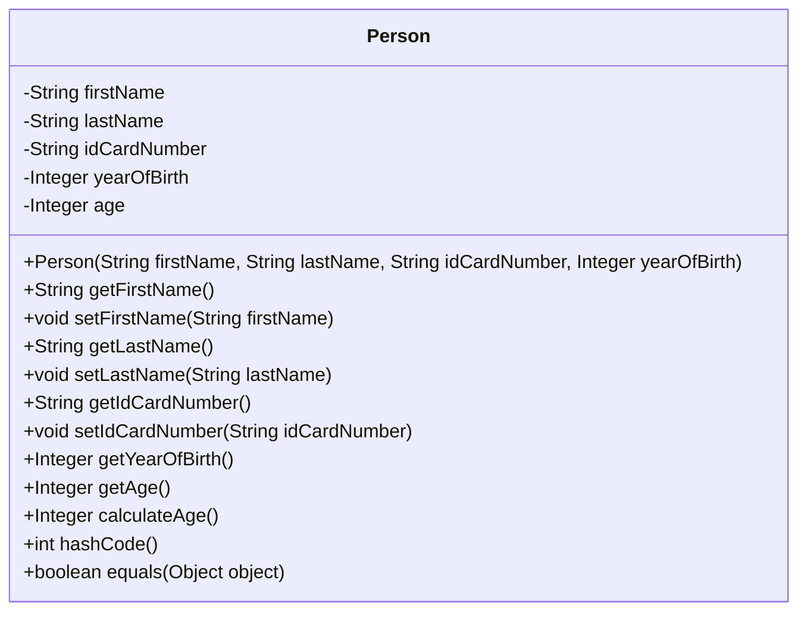
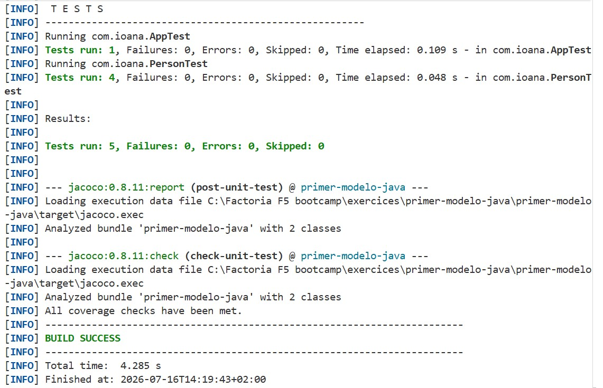
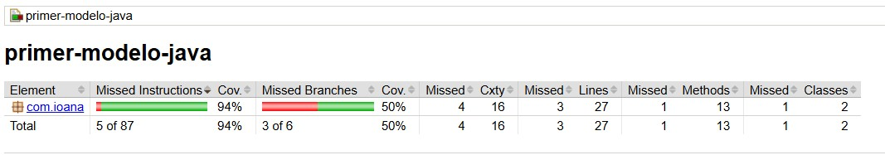

# My First Model

This exercise is part of the Factoria F5 bootcamp and aims to model the concept of a person using a Java class.

The person must include the following attributes:

- first name
- last name
- ID card number
- year of birth
- age, calculated based on the year of birth

The class must have a constructor that correctly initializes its attributes. In addition, the age must be calculated using a method, not manually.

> Note: There is no need to implement terminal output or develop a console application.

## Requirements

- Model the `Person` entity with its corresponding attributes.
- Implement a constructor to initialize the class attributes.
- Create the appropriate tests to ensure that the model works correctly.
- Achieve a minimum test coverage of 70%.

## Deliverables

- Class diagram

- Unit tests

- Coverage report

